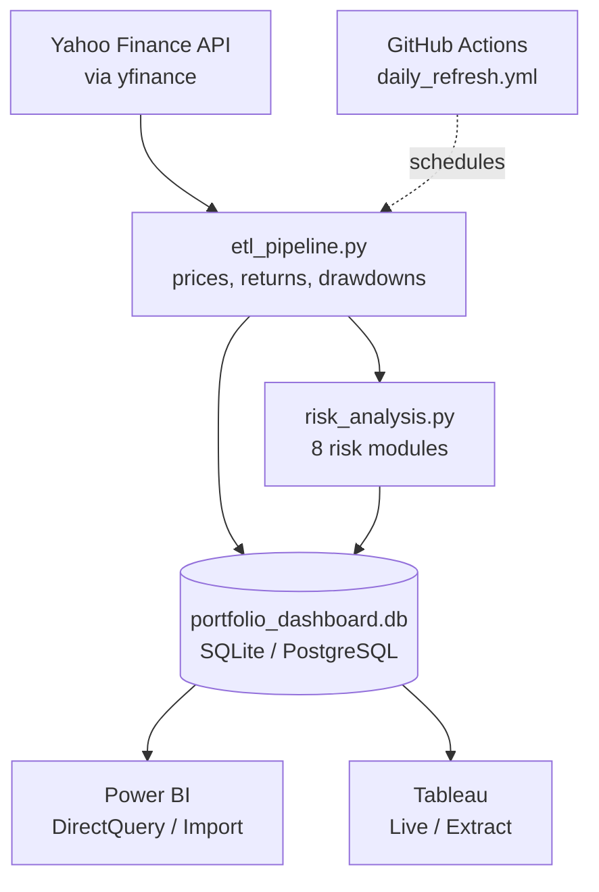

# RiskLens

A live Investment Portfolio Risk Dashboard. A Python ETL pipeline pulls real
market data from Yahoo Finance, computes a full suite of portfolio risk
metrics (VaR, stress tests, Monte Carlo, efficient frontier, and more), and
writes everything to a database that Power BI and Tableau can connect to for
an auto-refreshing dashboard.

## Architecture



**Three layers:**

1. **Ingestion** (`src/etl_pipeline.py`) — pulls 3 years of daily adjusted
   close prices for a 9-ticker portfolio + benchmark, validates data quality,
   computes returns/risk metrics/drawdowns/correlations, writes 6 tables.
2. **Risk Engine** (`src/risk_analysis.py`) — 8 modules covering VaR (3
   methods), historical stress testing, hypothetical scenarios, risk
   decomposition, regime detection, tail risk, efficient frontier, and Monte
   Carlo simulation. Writes 16 more tables. Runs automatically at the end of
   `run_pipeline()`.
3. **Visualization** — Power BI and Tableau connect directly to the database
   file. See [Connecting BI Tools](#connecting-bi-tools) below.

## Project Structure

```
RiskLens/
├── src/
│   ├── config.py             # Single source of truth: TICKERS, BENCHMARK, RISK_FREE_RATE, DB_URL, ...
│   ├── etl_pipeline.py       # Core data pipeline (prices, returns, risk metrics)
│   ├── risk_analysis.py      # 8-module risk engine (VaR, stress tests, Monte Carlo, ...)
│   └── verify_db.py          # Prints every table + row count + sample, runs sanity checks
├── tests/
│   ├── test_pipeline.py      # Unit tests for etl_pipeline.py
│   └── test_risk_analysis.py # Unit tests for risk_analysis.py
├── docs/
│   ├── data_dictionary.md    # Every column in every table, defined
│   └── risk_methodology.md   # Assumptions behind every risk module
├── .github/workflows/
│   └── daily_refresh.yml     # Scheduled CI: tests + pipeline run on weekdays
├── power_bi/                 # Place your .pbix + DAX notes here
├── tableau/                  # Place your .twbx + calc field notes here
└── requirements.txt
```

## Setup

```bash
git clone <this-repo>
cd RiskLens

python3 -m venv portfolio_env
source portfolio_env/bin/activate      # Windows: portfolio_env\Scripts\activate

pip install -r requirements.txt
```

## Running the Pipeline

To change the portfolio composition, edit only `src/config.py`.

```bash
cd src
python etl_pipeline.py
```

This fetches live market data, computes all metrics, and writes
`src/portfolio_dashboard.db` (SQLite). It also runs the full risk analysis
engine automatically as the last step.

### Verifying the output

```bash
cd src
python verify_db.py
```

Prints every table's row count and a 3-row sample, then runs sanity checks
(no NaNs, VaR monotonic across confidence levels, CVaR ≥ VaR, Monte Carlo
probabilities in [0,1], risk decomposition sums to portfolio volatility,
etc.).

### Running tests

```bash
python -m pytest tests/ -v
```

26 tests covering both the core pipeline and every risk module.

## Automation

`.github/workflows/daily_refresh.yml` runs the test suite on every push/PR,
and separately runs the full ETL pipeline on a weekday schedule (noon UTC,
~7 AM ET) or on manual trigger. The pipeline's own data quality gate
(`validate_data()` in `etl_pipeline.py`) raises and fails the job loudly if
price data looks wrong (nulls, too few rows, future dates, non-positive
prices, duplicate dates) — see [Known Limitations](#known-limitations) for
what this means for a scheduled SQLite setup specifically.

## Connecting BI Tools

This repo only produces the database — building the actual `.pbix`/`.twbx`
dashboard files requires the respective desktop apps. See
[Final Summary / Manual Steps](#final-summary--manual-steps-for-power-bi--tableau)
below (or ask for it) for exact connection settings.

## Screenshots

_Add Power BI and Tableau dashboard screenshots here once built:_

<!--
### Power BI — Executive Summary


### Power BI — Risk Analytics


### Tableau — Portfolio Overview

-->

## Known Limitations

- **SQLite + scheduled refresh**: SQLite is a local file, so a GitHub
  Actions-scheduled run produces a database that only exists inside that CI
  run (uploaded as a build artifact, not a persistent live endpoint). For a
  genuinely "live" dashboard that Power BI/Tableau can refresh on a schedule
  from anywhere, point `DB_URL` at a hosted PostgreSQL instance (Neon,
  Supabase, Railway — all have free tiers) instead.
- **yfinance rate limits**: Yahoo Finance has no official API and can
  rate-limit or intermittently fail multi-ticker batch downloads. The
  pipeline logs failures per-ticker but does not automatically retry.
